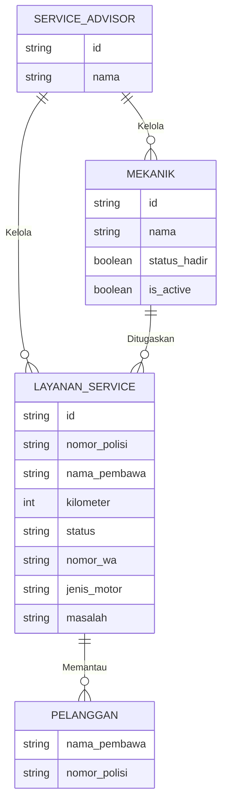
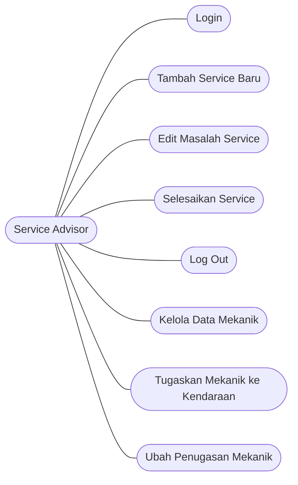
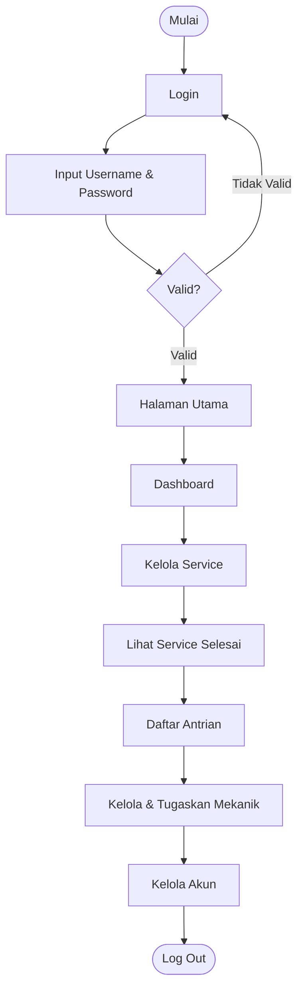
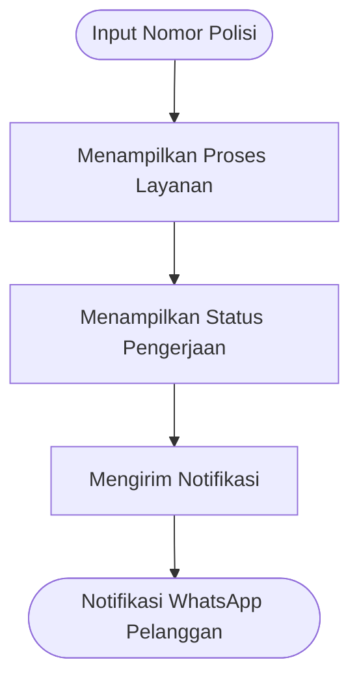
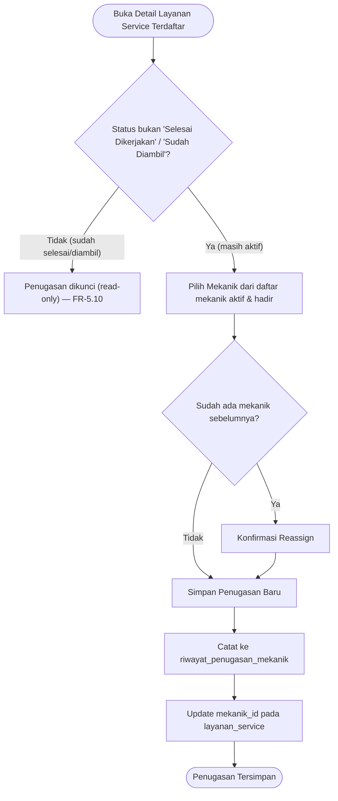

# Product Requirement Document (PRD)

# Sistem Monitoring Layanan Kendaraan Berbasis Web

## AHASS (Astra Honda Authorized Service Station) Kota Mamuju

**Versi Dokumen:** 1.1
**Tujuan Dokumen:** Menjadi referensi tunggal (single source of truth) bagi AI coding agent (mis. di VS Code) selama proses pengembangan, serta menjadi acuan pembagian iterasi/scope fitur dari awal hingga akhir pengembangan.

---

## 1. Ringkasan Eksekutif

Sistem yang dibangun adalah **aplikasi web monitoring status servis kendaraan** untuk bengkel resmi AHASS Kota Mamuju. Sistem menggantikan proses pencatatan manual (kertas kerja/komunikasi lisan) dengan pencatatan digital yang **real-time**, sehingga:

- **Service Advisor** dapat mencatat, memperbarui, dan mengelola status servis kendaraan pelanggan.
- **Pelanggan** dapat memantau status servis kendaraannya tanpa perlu datang atau menelepon, cukup dengan memasukkan nomor polisi kendaraan, dan menerima notifikasi WhatsApp saat status berubah (terutama saat selesai).
- **Pemilik/Manajemen bengkel** mendapatkan visibilitas operasional (jumlah unit masuk, mekanik yang hadir, antrean).

## 2. Latar Belakang Masalah

| Masalah                                             | Dampak                                                                                        |
| --------------------------------------------------- | --------------------------------------------------------------------------------------------- |
| Pencatatan servis masih manual (kertas/lisan)       | Rawan kehilangan data, sulit dilacak real-time                                                |
| Pelanggan menitipkan motor tanpa menunggu di lokasi | Tidak ada media informasi status yang jelas                                                   |
| Tidak ada transparansi status pengerjaan            | Pelanggan harus telepon/datang langsung untuk cek status → tidak efisien, menurunkan kepuasan |
| Penumpukan unit kendaraan saat ramai                | Bengkel kesulitan mengelola prioritas/antrean                                                 |

## 3. Tujuan Proyek

1. Menghasilkan sistem monitoring layanan kendaraan berbasis web yang **real-time**, **transparan**, dan **mudah diakses**.
2. Mengurangi kebutuhan komunikasi manual (telepon/kunjungan langsung) antara pelanggan dan bengkel.
3. Memberikan visibilitas operasional harian kepada Service Advisor/pemilik bengkel.
4. Sistem lulus uji kelayakan berdasarkan 4 aspek ISO 25010: _Functional Suitability, Portability, Usability, Performance Efficiency_.

## 4. Aktor & Peran Pengguna

| Aktor                               | Deskripsi                                                                                     | Akses                                                                                                                        |
| ----------------------------------- | --------------------------------------------------------------------------------------------- | ---------------------------------------------------------------------------------------------------------------------------- |
| **Service Advisor**                 | Staf front desk yang menerima kendaraan, mencatat keluhan, memperbarui status servis          | Login wajib (email + password)                                                                                               |
| **Mekanik**                         | Pihak yang mengerjakan servis secara teknis. Statusnya (hadir/tidak) ditampilkan di dashboard | Pada MVP: dikelola oleh Service Advisor (data master), belum tentu punya akun login sendiri — lihat catatan skop di Bagian 8 |
| **Pelanggan**                       | Pemilik kendaraan yang ingin memantau status servis                                           | **Tanpa login** — akses publik via input Nomor Polisi                                                                        |
| **Admin/Owner (opsional, non-MVP)** | Pemilik bengkel yang ingin melihat laporan                                                    | Ditandai sebagai _future scope_                                                                                              |

> Catatan penting untuk AI agent: role "Admin/Owner" maupun autentikasi terpisah untuk Mekanik **belum didefinisikan** pada tahap ini. Role ini hanya diasumsikan sebagai pengembangan lanjutan (Fase 3), bukan bagian dari MVP. Jangan berasumsi ada endpoint/role tersebut kecuali diminta eksplisit oleh pengguna.

## 5. Tech Stack (Wajib Diikuti)

| Layer          | Teknologi                        | Catatan                                                                                      |
| -------------- | -------------------------------- | -------------------------------------------------------------------------------------------- |
| Frontend       | **ReactJS** (component-based)    | SPA (Single Page Application)                                                                |
| Styling        | **Tailwind CSS** (utility-first) | Tidak menggunakan komponen UI library berat, styling langsung via class                      |
| Backend / BaaS | **Supabase**                     | PostgreSQL (RDBMS relasional), Auth, Realtime Subscription, Storage, auto-generated REST API |
| Deployment     | **Vercel**                       | Continuous deployment via integrasi GitHub                                                   |
| Notifikasi     | **WhatsApp**                     | Mekanisme pengiriman **belum ditentukan** — perlu keputusan implementasi (lihat Bagian 11)   |

**Batasan AI agent:** jangan mengganti stack di atas (mis. ke Next.js penuh, Firebase, atau MySQL manual) tanpa instruksi eksplisit dari pengguna. Kombinasi ReactJS + Tailwind + Supabase + Vercel adalah keputusan arsitektur yang mengikat untuk proyek ini.

## 6. Model Pengembangan

Proyek ini mengikuti model **Waterfall** (Analisis Kebutuhan → Desain Sistem → Coding → Testing → Deployment/Maintenance). Untuk kebutuhan praktis pengembangan dibantu AI agent, dokumen ini **memecah Waterfall tersebut menjadi iterasi bertahap** (Bagian 13) agar tetap bisa dikerjakan secara inkremental.

## 7. Skema Data / Struktur Database (Supabase / PostgreSQL)

### 7.0 ERD Konseptual Awal

Diagram berikut adalah ERD konseptual inti, dituliskan dalam notasi Mermaid agar dapat dirender langsung di VS Code/editor Markdown. Diagram ini sudah mencakup entitas `MEKANIK` agar konsisten dengan modul Manajemen & Penugasan Mekanik pada Bagian 8.5.



> Catatan: relasi "Memantau" merepresentasikan bahwa pelanggan memantau layanan service miliknya (diasumsikan satu layanan service dipantau oleh satu pelanggan). Relasi "Ditugaskan" merepresentasikan satu mekanik dapat ditugaskan pada banyak `layanan_service` dari waktu ke waktu, namun setiap `layanan_service` hanya memiliki satu mekanik aktif pada satu waktu (lihat aturan bisnis di Bagian 8.5).

### Skema Database Teknis (Perluasan Implementasi)

ERD konseptual di atas bersifat ringkas dan tidak cukup untuk langsung diimplementasikan. Berikut skema yang **diperluas secara wajar**, dengan tetap konsisten terhadap field-field yang disebut eksplisit pada ERD di atas.

### 7.1 Tabel `service_advisors`

| Kolom      | Tipe        | Keterangan                         |
| ---------- | ----------- | ---------------------------------- |
| id         | uuid (PK)   | terhubung ke `auth.users` Supabase |
| nama       | text        |                                    |
| email      | text        |                                    |
| created_at | timestamptz |                                    |

### 7.2 Tabel `mekanik` (data master, bukan akun login di MVP)

| Kolom        | Tipe                      | Keterangan                                                                                                                            |
| ------------ | ------------------------- | ------------------------------------------------------------------------------------------------------------------------------------- |
| id           | uuid (PK)                 |                                                                                                                                       |
| nama         | text                      |                                                                                                                                       |
| status_hadir | boolean (default `false`) | dipakai untuk kartu "Mekanik yang Hadir" di dashboard; diubah manual oleh Service Advisor (FR-5.3)                                    |
| is_active    | boolean (default true)    | soft-delete flag (FR-5.4); mekanik nonaktif tidak muncul di pilihan penugasan (FR-5.6) tapi riwayat penugasan lamanya tetap tersimpan |
| created_at   | timestamptz               |                                                                                                                                       |

### 7.3 Tabel `pelanggan`

| Kolom        | Tipe                              | Keterangan                             |
| ------------ | --------------------------------- | -------------------------------------- |
| id           | uuid (PK)                         |                                        |
| nama_pembawa | text                              | sesuai ERD konseptual ("Nama_Pembawa") |
| nomor_polisi | text (unique per kendaraan aktif) | sesuai ERD konseptual                  |
| nomor_wa     | text                              | untuk pengiriman notifikasi WhatsApp   |
| created_at   | timestamptz                       |                                        |

### 7.4 Tabel `layanan_service` (entitas inti)

| Kolom                   | Tipe                             | Keterangan                                                                                           |
| ----------------------- | -------------------------------- | ---------------------------------------------------------------------------------------------------- |
| id                      | uuid (PK)                        |                                                                                                      |
| nomor_polisi            | text                             | dari ERD                                                                                             |
| nama_pembawa            | text                             | dari ERD                                                                                             |
| nomor_wa                | text                             | dari ERD                                                                                             |
| jenis_motor             | text                             | dari ERD                                                                                             |
| kilometer               | integer                          | dari ERD                                                                                             |
| masalah                 | text                             | keluhan pelanggan, dari ERD                                                                          |
| status                  | enum                             | lihat Bagian 7.7 (state machine)                                                                     |
| service_advisor_id      | uuid (FK → service_advisors.id)  | relasi "Kelola" pada ERD                                                                             |
| pelanggan_id            | uuid (FK → pelanggan.id)         | relasi "Memantau" pada ERD                                                                           |
| mekanik_id              | uuid (FK → mekanik.id, nullable) | mekanik yang sedang ditugaskan menangani kendaraan ini (FR-5.6/5.7); `null` berarti belum ditugaskan |
| tanggal_masuk           | timestamptz                      |                                                                                                      |
| tanggal_selesai         | timestamptz (nullable)           |                                                                                                      |
| created_at / updated_at | timestamptz                      |                                                                                                      |

### 7.5 Tabel `riwayat_status` (log perubahan status — direkomendasikan untuk mendukung "Riwayat Service" & realtime)

| Kolom              | Tipe                            | Keterangan |
| ------------------ | ------------------------------- | ---------- |
| id                 | uuid (PK)                       |            |
| layanan_service_id | uuid (FK)                       |            |
| status_baru        | text                            |            |
| diubah_oleh        | uuid (FK → service_advisors.id) |            |
| waktu              | timestamptz                     |            |

### 7.6 Tabel `riwayat_penugasan_mekanik` (log penugasan/reassign mekanik — mendukung FR-5.9)

| Kolom              | Tipe                            | Keterangan                            |
| ------------------ | ------------------------------- | ------------------------------------- |
| id                 | uuid (PK)                       |                                       |
| layanan_service_id | uuid (FK → layanan_service.id)  |                                       |
| mekanik_id         | uuid (FK → mekanik.id)          | mekanik yang ditugaskan pada aksi ini |
| ditugaskan_oleh    | uuid (FK → service_advisors.id) |                                       |
| waktu              | timestamptz                     |                                       |

### 7.7 State Machine Status Servis (asumsi wajar — perlu dikonfirmasi ke pengguna sebelum dikunci)

```
Menunggu Antrian → Diperiksa → Dikerjakan → Selesai Dikerjakan → Sudah Diambil
```

> **Wajib dikonfirmasi ke pengguna** sebelum implementasi — nama-nama status di atas belum final.

## 8. Spesifikasi Fitur (Functional Requirements)

### 8.1 Modul Autentikasi (Service Advisor)

- FR-1.1: Login menggunakan email & password (Supabase Auth).
- FR-1.2: Validasi kredensial → jika tidak valid, tetap di halaman login dengan pesan error.
- FR-1.3: Logout mengakhiri sesi.

### 8.2 Modul Dashboard (Service Advisor)

- FR-2.1: Menampilkan kartu **"Total Unit Entry di Pit"** (jumlah kendaraan yang sedang dalam proses hari ini).
- FR-2.2: Menampilkan kartu **"Mekanik yang Hadir"**.
- FR-2.3: Menampilkan tabel **"Aktifitas Hari Ini"** berisi: Nama Pegawai, Tipe Motor, Keterangan, Status.

> **Catatan konsistensi:** kolom "Nama Pegawai" pada FR-2.3 tumpang tindih secara makna dengan fitur penugasan mekanik pada Bagian 8.5 (FR-5.6). **Perlu dikonfirmasi ke pengguna** apakah kolom ini dimaksudkan sebagai nama mekanik yang ditugaskan (`mekanik_id` pada `layanan_service`, Bagian 7.4) — jika ya, agent sebaiknya mengganti label kolom menjadi "Mekanik yang Ditugaskan" agar konsisten dengan skema data.

### 8.3 Modul Kelola Service

- FR-3.1: **Tambah Service Baru** — input data: nomor polisi, nama pembawa, nomor WA, jenis motor, kilometer, keluhan/masalah.
- FR-3.2: **Edit Layanan Service** — mengubah data layanan yang sudah tercatat (nomor polisi, nama pembawa, nomor WA, jenis motor, kilometer, masalah; status diubah lewat FR-3.3). Kontak pada data kendaraan (`pelanggan`) ikut diperbarui. Layanan berstatus `Sudah Diambil` terkunci dan tidak dapat diedit.
- FR-3.3: **Ubah Status Service** — Service Advisor memindahkan status maju atau mundur satu langkah sesuai urutan Bagian 7.7 (mekanik melapor, Service Advisor yang mengklik). `tanggal_selesai` terisi saat status menjadi `Selesai Dikerjakan` dan dikosongkan bila mundur dari status itu. `Sudah Diambil` bersifat final (data terkunci). Aturan transisi ditegakkan di database.
- FR-3.4: Setiap perubahan status tercatat ke `riwayat_status` dan memicu update realtime (Supabase Realtime Subscription) ke tampilan pelanggan.
- FR-3.5: **Hapus Layanan Service** — layanan yang terlanjur dibuat dapat dihapus, hanya selama berstatus `Menunggu Antrian`.

### 8.4 Modul Riwayat Service

- FR-4.1: Menampilkan daftar servis yang sudah selesai/lampau, dapat difilter (mis. per tanggal/nomor polisi).

### 8.5 Modul Manajemen Mekanik

**A. Pengelolaan Data Mekanik**

- FR-5.1: **Tambah Mekanik** — Service Advisor menambahkan data mekanik baru (nama, status hadir default `false`).
- FR-5.2: **Edit Mekanik** — mengubah nama mekanik.
- FR-5.3: **Ubah Status Hadir** — Service Advisor dapat mengubah status hadir mekanik (hadir/tidak hadir) setiap hari; nilai ini yang ditampilkan pada kartu dashboard "Mekanik yang Hadir" (FR-2.2).
- FR-5.4: **Nonaktifkan Mekanik** — mekanik yang sudah tidak bekerja di bengkel dinonaktifkan (soft delete via kolom `is_active`), bukan dihapus permanen, agar riwayat penugasan sebelumnya tetap utuh.
- FR-5.5: **Daftar Mekanik** — menampilkan seluruh mekanik aktif beserta status hadir dan jumlah unit kendaraan yang sedang ditanganinya saat ini (beban kerja).

**B. Penugasan Mekanik ke Kendaraan Terdaftar**

- FR-5.6: **Tugaskan Mekanik** — dari sebuah `layanan_service` yang sudah terdaftar (hasil FR-3.1), Service Advisor memilih satu mekanik untuk ditugaskan mengerjakan kendaraan tersebut. Hanya mekanik dengan `is_active = true` yang dapat dipilih.
- FR-5.7: **Ubah Penugasan (Reassign)** — Service Advisor dapat mengganti mekanik yang sedang ditugaskan pada suatu `layanan_service` ke mekanik lain sebelum servis selesai.
- FR-5.8: **Lihat Penugasan per Mekanik** — dari halaman Manajemen Mekanik, Service Advisor dapat melihat daftar kendaraan (nomor polisi) yang sedang ditangani oleh seorang mekanik tertentu.
- FR-5.9: Setiap aksi tugaskan/ubah penugasan tercatat pada tabel `riwayat_penugasan_mekanik` (Bagian 7.6) untuk keperluan audit.
- FR-5.10: Kendaraan dengan status "Selesai Dikerjakan" atau "Sudah Diambil" tidak dapat lagi diubah penugasan mekaniknya (field non-editable).

> **Aturan bisnis yang perlu dikonfirmasi ke pengguna:** apakah satu kendaraan hanya boleh ditangani oleh **satu mekanik** dalam satu waktu (asumsi default pada PRD ini), atau boleh ditangani oleh **lebih dari satu mekanik sekaligus** (butuh tabel penugasan many-to-many). Implementasi saat ini mengasumsikan skenario pertama (satu mekanik per kendaraan, via kolom `mekanik_id` pada `layanan_service`).

### 8.6 Modul Akun (Service Advisor)

- FR-6.1: Melihat/mengubah data akun (nama, email, password).

### 8.7 Modul Monitoring Pelanggan (Publik, Tanpa Login)

- FR-7.1: Pelanggan memasukkan **Nomor Polisi** kendaraan pada halaman publik.
- FR-7.2: Sistem menampilkan **daftar unit entry** (No, No Polisi, Status Unit) yang cocok.
- FR-7.3: Status yang ditampilkan **update secara real-time** (Supabase Realtime) mengikuti perubahan yang dilakukan Service Advisor.
- FR-7.4: Sistem **mengirim notifikasi WhatsApp** ke pelanggan saat status berubah (minimal saat servis selesai).

### 8.8 Desain UI/UX — Didelegasikan ke AI Agent

Tata letak, palet warna, tipografi, maupun komponen UI **tidak dibatasi** oleh dokumen ini — AI agent bebas menentukan desain selama:

- Seluruh data/field pada FR-1 s.d. FR-7 tetap tersaji dan berfungsi.
- Memenuhi aspek Portability & Usability pada Bagian 9 (responsive, mudah digunakan).
- Tetap menggunakan Tailwind CSS sebagai basis styling (Bagian 5).

## 9. Non-Functional Requirements (dipetakan ke ISO 25010)

| Aspek ISO 25010            | Kriteria Uji                                                                                                                       | Target Implementasi                                                                                                     |
| -------------------------- | ---------------------------------------------------------------------------------------------------------------------------------- | ----------------------------------------------------------------------------------------------------------------------- |
| **Functional Suitability** | Kelengkapan data/fitur; tombol/menu berfungsi; skor kelayakan ≥ 50% dianggap valid                                                 | Semua FR di Bagian 8 harus berfungsi tanpa error sebelum dianggap "Done"                                                |
| **Portability**            | Sistem berjalan pada perangkat berbeda (HP, komputer, laptop)                                                                      | Wajib **responsive design** (Tailwind breakpoints) — mobile-first, mengingat pelanggan mayoritas akan mengakses dari HP |
| **Usability**              | Diukur kuesioner Skala Likert (Usefulness, Easy of Use, Easy of Learning, Satisfaction); target kelayakan minimal "Layak" (61–80%) | UI harus sederhana, minim langkah, terutama halaman publik pelanggan (cukup 1 input field)                              |
| **Performance Efficiency** | Rata-rata waktu respon pengambilan data dari server                                                                                | Gunakan Supabase query yang efisien (index pada `nomor_polisi`), hindari over-fetching                                  |

## 10. Diagram & Alur Sistem

> Seluruh diagram di bawah adalah acuan alur logika, **bukan** acuan tata letak visual (lihat Bagian 8.8 mengenai desain UI).

### 10.1 Use Case Diagram



> Catatan: use case di atas hanya mencakup aktor **Service Advisor**. Interaksi Pelanggan digambarkan terpisah lewat flowchart (Bagian 10.3), bukan use case diagram. Use case UC6–UC8 (pengelolaan & penugasan mekanik) adalah penambahan pada versi dokumen ini — lihat Bagian 8.5.

### 10.2 Flowchart Service Advisor



> Catatan: node "Kelola & Tugaskan Mekanik" ditambahkan pada versi dokumen ini agar flowchart konsisten dengan modul Manajemen & Penugasan Mekanik (Bagian 8.5).

### 10.3 Flowchart Pelanggan



### 10.4 Alur Penugasan Mekanik (mendukung FR-5.6 – FR-5.10)



## 11. Integrasi Notifikasi WhatsApp (Keputusan Implementasi yang Perlu Diambil)

Mekanisme pengiriman notifikasi WhatsApp **belum ditentukan**. Sebelum agent mengimplementasikan, opsi yang tersedia:

1. **WhatsApp Business API resmi (Meta Cloud API)** — resmi, butuh verifikasi bisnis, ada biaya per pesan.
2. **Provider pihak ketiga** (mis. Fonnte, Wablas, Twilio WhatsApp API) — lebih cepat diintegrasikan untuk skala kecil.
3. **Simulasi/mock** untuk keperluan demo (jika akses API tidak tersedia) — mis. hanya mencatat log "notifikasi terkirim" tanpa benar-benar mengirim.

> **Agent WAJIB bertanya ke pengguna** provider mana yang akan dipakai sebelum mengimplementasikan modul ini — jangan berasumsi sendiri karena ini menyangkut biaya dan kredensial API pihak ketiga.

## 12. Ruang Lingkup (Scope)

### In-Scope

- Login Service Advisor
- Dashboard operasional harian
- CRUD data servis (tambah, edit, selesaikan)
- Riwayat servis
- Manajemen data mekanik
- Kelola akun Service Advisor
- Halaman publik monitoring pelanggan berbasis nomor polisi
- Notifikasi WhatsApp saat status berubah
- Pengujian ISO 25010 (Functional Suitability, Portability, Usability, Performance Efficiency)

### Out-of-Scope (jangan dikerjakan kecuali diminta eksplisit)

- Manajemen stok sparepart
- Transaksi pembayaran/invoice
- Laporan keuangan
- Sistem reservasi/booking online
- Akun login terpisah untuk Mekanik
- Aplikasi mobile native (di luar web responsive)
- Multi-cabang/multi-tenant AHASS

## 13. Roadmap Iterasi Pengembangan (untuk pembagian kerja AI Agent)

> Setiap iterasi harus menghasilkan build yang **berjalan dan dapat diuji**.

### **Iterasi 0 — Setup Fondasi**

- Inisialisasi project React + Tailwind, struktur folder, konfigurasi Supabase client, setup deployment Vercel awal (halaman kosong/placeholder).
- Buat skema database di Supabase sesuai Bagian 7.
- **Definition of Done:** Project bisa di-deploy ke Vercel, koneksi ke Supabase berhasil (test query sederhana).

### **Iterasi 1 — Autentikasi Service Advisor**

- Implementasi FR-1.1 – FR-1.3.
- **DoD:** Service Advisor bisa login/logout, sesi tersimpan, halaman terproteksi (redirect ke login jika belum auth).

### **Iterasi 2 — Modul Kelola Service (Core CRUD)**

- Implementasi FR-3.1 – FR-3.5 (tanpa realtime dulu, tanpa WhatsApp dulu).
- **DoD:** Service Advisor bisa menambah, mengedit, dan menyelesaikan data servis; data tersimpan di Supabase.

### **Iterasi 3 — Dashboard & Riwayat**

- Implementasi FR-2.1 – FR-2.3 (Dashboard) dan FR-4.1 (Riwayat).
- **DoD:** Dashboard menampilkan data agregat real dari database; halaman riwayat menampilkan servis selesai.

### **Iterasi 4 — Manajemen Mekanik & Akun**

- Implementasi FR-5.1 – FR-5.5 (CRUD mekanik, status hadir, nonaktifkan) dan FR-6.1 (Kelola Akun).
- **DoD:** Service Advisor bisa menambah/mengedit/menonaktifkan mekanik, mengubah status hadir, dan melihat daftar mekanik beserta beban kerjanya; bisa update data akun.

### **Iterasi 4b — Penugasan Mekanik ke Kendaraan**

- Implementasi FR-5.6 – FR-5.10 (tugaskan, reassign, lihat penugasan per mekanik, kunci penugasan pada servis yang sudah selesai).
- Buat tabel `riwayat_penugasan_mekanik` (Bagian 7.6).
- **DoD:** Dari sebuah kendaraan terdaftar, Service Advisor bisa memilih & menugaskan mekanik yang hadir; penugasan bisa diubah selama servis belum selesai; setiap aksi tercatat di riwayat.

### **Iterasi 5 — Halaman Publik Monitoring Pelanggan**

- Implementasi FR-7.1 – FR-7.2 (tanpa realtime/WA dulu — cukup query on-demand).
- **DoD:** Pelanggan bisa input nomor polisi dan melihat status terkini.

### **Iterasi 6 — Realtime Update**

- Aktifkan Supabase Realtime Subscription pada tabel `layanan_service` agar halaman Dashboard & Monitoring Pelanggan update otomatis tanpa refresh (FR-3.4, FR-7.3).
- **DoD:** Perubahan status oleh Service Advisor langsung terlihat di halaman pelanggan tanpa reload.

### **Iterasi 7 — Notifikasi WhatsApp**

- Setelah keputusan provider diambil (Bagian 11), implementasikan FR-7.4.
- **DoD:** Notifikasi terkirim (atau tercatat, jika mode simulasi) saat status servis berubah ke "Selesai".

### **Iterasi 8 — Responsive & Usability Polish**

- Uji tampilan di berbagai ukuran layar (HP, tablet, laptop) — memenuhi aspek Portability.
- Sederhanakan alur input, tambahkan feedback visual (loading, error state) — memenuhi aspek Usability.
- **DoD:** Tidak ada elemen UI yang rusak/terpotong di breakpoint utama Tailwind (sm, md, lg).

### **Iterasi 9 — Pengujian & Perbaikan (ISO 25010)**

- Siapkan build untuk pengujian Functional Suitability (kuesioner ahli) dan Usability (kuesioner responden) sesuai Bagian 9.
- Perbaiki bug/fitur yang mendapat skor "Tidak Valid" atau "Kurang Layak".
- **DoD:** Semua fitur inti berstatus valid secara fungsional; siap untuk deployment final.

### **Iterasi 10 — Deployment Final & Dokumentasi**

- Deploy versi final ke Vercel (production).
- Dokumentasikan environment variables, skema database, dan panduan penggunaan singkat.
- **DoD:** Sistem dapat diakses publik via URL Vercel, siap dipakai AHASS Kota Mamuju.

## 14. Batasan Kerja untuk AI Agent (Guardrails)

1. **Jangan mengganti stack teknologi** (ReactJS, Tailwind, Supabase, Vercel) tanpa persetujuan eksplisit pengguna.
2. **Jangan menambahkan fitur di luar scope** (Bagian 12 "Out-of-Scope") tanpa diminta.
3. **Jangan mengunci nama-nama status servis** (Bagian 7.7) sebagai final tanpa konfirmasi pengguna.
4. **Jangan mengimplementasikan integrasi WhatsApp** dengan provider/kredensial tertentu tanpa persetujuan eksplisit pengguna (Bagian 11).
5. Ikuti urutan iterasi pada Bagian 13 kecuali pengguna meminta lompat/mengubah prioritas.
6. Setiap iterasi harus menghasilkan kode yang dapat dijalankan (`npm run dev` / build sukses) sebelum lanjut ke iterasi berikutnya.
7. Field data (nomor polisi, nama pembawa, nomor WA, jenis motor, kilometer, masalah, status) harus konsisten dengan ERD (Bagian 7.0 & 7.4) — jangan mengganti nama kolom secara sepihak.
8. **Desain UI/UX bebas ditentukan oleh AI agent** (Bagian 8.8) — jangan meminta persetujuan desain kecuali pengguna menanyakannya.
9. **Jangan mengimplementasikan penugasan mekanik many-to-many** (satu kendaraan ditangani beberapa mekanik sekaligus) tanpa konfirmasi pengguna — asumsi default adalah satu mekanik per kendaraan (lihat catatan aturan bisnis di Bagian 8.5).

---

_Dokumen ini adalah working reference pengembangan yang berdiri sendiri, ditulis agar dapat dipahami dan diikuti tanpa memerlukan akses ke dokumen lain._
